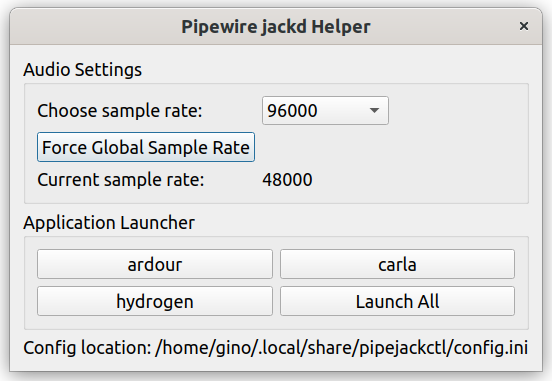

# pipejackctl

## Description
Control pipewire sample rate and launch jackd apps with correct sample rate.

## Background
This is a helper tool in the style of qjackctl which scripts up tasks necessary to successfully use jackd on systems that have pipewire as their audio subsystem.

Whilst pipewire provides several improvements to linux audio, there are a number of jackd pro audio apps that need to be launched in a jackd environment in order to operate correctly

There are also machine specific issues that can impact pro audio recording and processing. Consider a pro-audio USB card running at 92 kHz sample rate used on a laptop which also has a built in consumer level audio card running at 42 kHz. Pipewire has the ability to run both cards at their various sample rates. However, certain linux digital audio workstations (DAWs) will crash if set to one sample rate and accidently or automatically connect to an audio card running at a different sample rate.

This application solves both these problems by forcing pipewire to be at a set sample rate system wide (even for cards that can't support that rate), and launching jackd audio apps with the chosen sample rate.

## Installation

Download the package and run with:
<code>python3 main.py</code>

The application will create a config file in your operating systems local app data directory and run.

The location of the config file will be displayed at the bottom of the app screen. Usually this will be something like:

<code>~/.local/share/pipejackctl</code>

Edit the config file to customise your settings. Any change to the config file will only be picked up after restarting the app. In linux all settings are case sensitive.

You may wish to setup any jackd applications you may need to run. Applications are comma separated. Paths are only necessary for executables that may not be in your PATH, e.g. in the following example, paths are not supplied for ardour and carla, but are for hydrogen.

<code>applicationlocations = ardour,carla,/opt/hydrogen/hydrogen</code>

Setting the default sampling rate you wish to use will save some clicks in the long term:

<code>defaultsamplingrate = 96000</code>

You may also need to define the locations of your pipewire executables:

<code> pwmetadatacommand = pw-metadata</code>
<code> pwjackcommand = pw-jack</code>

## Usage
Typical usage involves:
1) Launching the application
2) Selecting the desired sample rate from the drop down list
3) Forcing the pipewire sample rate by pressing the "Force Global Sample Rate" Button
4) Launching the application you desire by clicking the relevant button (or alternatively launching all of the applications simultaneously if your system can handle the load without xruns )

## Visuals

## Roadmap
Features added to this app will depend on the progress DAWs and others make towards working more seamlessly with pipewire. 

## Contributing
Open to contributions of features.

## License
[LICENSE](./LICENSE)

